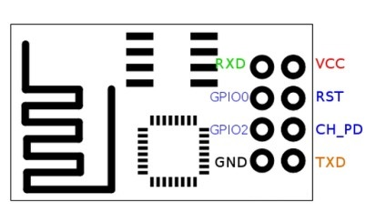
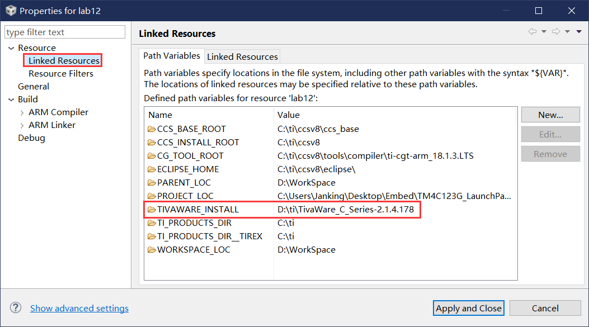
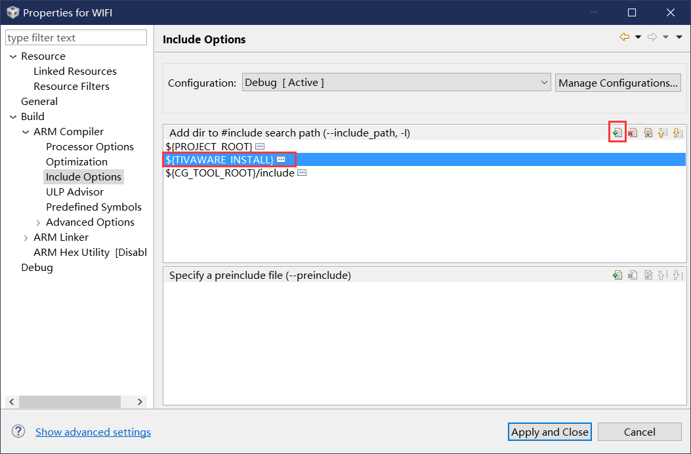

# WIFIModule

## 介绍

esp8266与TIVA C的连接---CCS项目

## 软件架构

软件架构说明

## 安装教程

1. 连线

   

   （上图的ESP8266接口图）

   | ESP8266 | TM4C123GXL              |
   | ------- | ----------------------- |
   | VCC     | 3.3V                    |
   | GND     | GND                     |
   | RST     | PD0                     |
   | RXD     | PB1                     |
   | TXD     | PB0                     |
   | CH_PD   | 3.3V(最好跟VCC焊接起来) |

   | MPU6050 | TM4C123GXL |
   | ------- | ---------- |
   | VCC     | 3.3V       |
   | GND     | GND        |
   | SCL     | PB2        |
   | SDA     | PB3        |

   | 蜂鸣器 | TM4C123GXL |
   | ------ | ---------- |
   | VCC    | 3.3V       |
   | GND    | GND        |
   | I/O    | PA2        |

   

   连接成功后ESP8266模块会亮红色，发送指令时会额外有蓝灯

2. 如果有下列错误

   
   解决办法：

   

   


## 使用说明

1. 默认WIFI：

   1. `EmbedTest` 
   2. `1234abcd`

   > 如果不想修改代码，可以用电脑创建一个这样的热点

2. 默认服务器：

   1. TCP
   2. `111.230.11.142` 
   3. `8080`

3. 当前板子的状态用变量Status表示

   1. Status==0表示正在建立连接，此时如果网络正常的话灯会按照红色。蓝色。绿色变化
   2. Status==1表示监听服务器，一般处于这个状态
   3. Status==2表示正在排查网络。每隔10s会检测一次网络状况

4. 通过灯的颜色可以判断当前状态**（加粗表示服务器API）**

   **注意：**服务器不要发8个字符以上的字符串，因为每次只解析8位，超过8位会当做两个命令！

   | 颜色     | 状态                                                         |
   | -------- | ------------------------------------------------------------ |
   | 红色     | WIFI未连接                                                   |
   | 蓝色     | WIFI连接上，服务器未连接                                     |
   | 绿色     | 正常工作：服务器连接上且正在监听（并不是连上服务器就是绿灯，它需要等待一些处理） |
   | 黄色     | 出现致命错误，无法自动恢复                                   |
   | **粉色** | **收到服务器发送的字符串，且是字符‘c’开头**                  |
   | **青色** | **收到服务器发送的字符串，且是字符‘b’开头**                  |
   | **白色** | **收到服务器发送的字符串，且是字符‘a’开头**                  |

5. 为了稳定性，板子正常启动会很慢

   测试模式差不多33s连接到网络，3s开始收到第一个数据

   差不多5s恢复可以从断网中恢复（服务器断开又连接）

   差不多35s检测到服务器断开（检测网路状态）

   > 这个排查网络的时间比较难设置，如果太慢很难捕获网络状态，如果太快排查需要时间又影响命令发送

6. 不支持5G Hz的WIFI

7. **服务器传的数据不要有“`OK`”，也不要用`2,3,4,5`的数字**

   **板子收到正确的命令后，会回复一个相同的命令（如收到`a`会回复`a`）**

   - **板子会定时发送字符‘`?`’表示正在排查网络，此时发送命令无效，后续也不接到，需要重发**
   - **排查结束会发送‘`!`’表示排查结束，可以发送命令**

8. 正常运行时会向服务器发送加速度，温度，角速度的数据

   - 格式为

     ```
     [x轴加速度，y轴加速度，z轴加速度][温度][x轴角速度，y轴角速度，z轴角速度]
     ```

     > 加速度需要减去16384.0得到g的倍数
     >
     > 温度单位是摄氏度
     >
     > 角速度未处理，正常应该 为0

9. 如果遇到剧烈晃动，x + y + z轴加速度总和相比初始时加速度总和变化大于 2g，则会触发蜂鸣器；

   警报解除后蜂鸣器会恢复静音

   > 产生警报时会向服务器发送字符'@'

